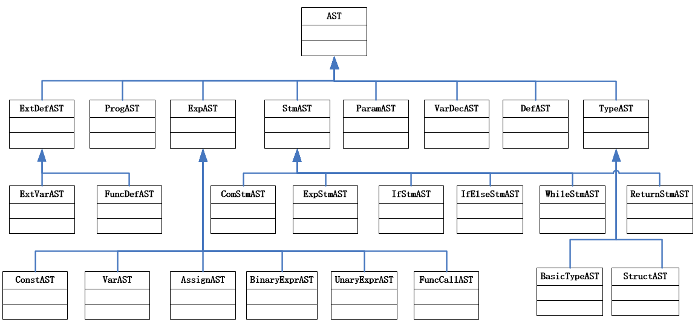

# houC

## 语法
```bison
program: ExtDefList		

ExtDefList:
          | ExtDef ExtDefList
          
ExtDef:     Specifier ExtDecList SEMI
          | Specifier ID LP ParamList RP CompSt
          | Specifier ID LP ParamList RP SEMI
          
Specifier:  TYPE

ExtDecList: VarDec
          | VarDec COMMA ExtDecList

VarDec:     ID   
          | VarDec LB INT RB

ParamList:
          | ParamDec  
          | ParamList COMMA ParamDec
          
ParamDec:   Specifier VarDec

CompSt:     LC DefList StmList RC

StmList:
          | Stmt StmList

DefList: 
          | Def DefList

Def:   		Specifier DecList SEMI 

DecList:    Dec
          | Dec COMMA DecList
          
Dec:  		VarDec
       	  | VarDec ASSIGN Exp
       	  | VarDec ASSIGN LC ArrExp RC

ArrExp: 	Exp
       	  |LC ArrExp RC
          |ArrExp COMMA ArrExp

Stmt:   	Exp SEMI
      	  | CompSt
      	  | RETURN Exp SEMI
      	  | RETURN SEMI
      	  | IF LP Exp RP Stmt %prec LOWER_THEN_ELSE
      	  | IF LP Exp RP Stmt ELSE Stmt
      	  | WHILE LP Exp RP Stmt 
      	  | error SEMI

Exp:    	Exp ASSIGN Exp
      	  | Exp PLUS Exp 
       	  | Exp MINUS Exp
       	  | Exp STAR Exp
       	  | Exp DIV Exp 
       	  | LP Exp RP
       	  | MINUS Exp %prec UMINUS  
       	  | PLUS Exp %prec UPLUS

       	  | Exp AND Exp   
       	  | Exp OR Exp    
       	  | NOT Exp

       	  | Exp GT Exp	
       	  | Exp GE Exp 	
       	  | Exp LT Exp 	
       	  | Exp LE Exp 	
       	  | Exp NE Exp 
       	  | Exp EQ Exp


       	  | DPLUS Exp


       	  | ID LP Args RP
       	  | ID            	
       	  | INT           	
       	  | FLOAT       
       	  
Args:  
       	  |  Exp 
       	  |	 Args COMMA  Exp
```


## 绑定关系
```
ProgAST*                 program;
vector <ExtDefAST*> 	 ExtDefList;  	    //外部定义（外部变量、函数）列表
ExtDefAST* 				 ExtDef;
vector <VarDecAST*>  	 ExtDecList;        //外部变量列表（目前后续只考虑是标识符，可扩展为数组）
TypeAST*				 Specifier;
VarDecAST* 				 VarDec;
CompStmAST*				 CompSt;
vector <ParamAST*>  	 ParamList;         //形参列表
ParamAST* 				 ParamDec;
vector <StmAST*>   		 StmList;
StmAST* 				 Stmt;
vector <DefAST*>   		 DefList;
DefAST* 				 Def;
vector <VarDecAST*> 	 DecList;
VarDecAST* 				 Dec;
ExpAST* 				 Exp;
vector <ExpAST*>    	 Args;       		//实参列表
```

## Class of AST




```
class AST ProgAST ExtDefAST TypeAST VarDecAST CompStmAST ParamAST StmAST DefAST VarDecAST ExpAST
```

## Class of Symbol

```
class Symbol VarSymbol FuncSymbol SymbolsInAScope SymbolStackDef
```

## Class of IRCode

```
class Opn//变量或函数表示
class IRCode//四元式结构
```

## Class of Error Management

```
extern map <int,string> SymbolMap;
extern map <int,int>    TypeWidth;
```


```
typedef struct { int Line,Column;  string ErrMsg; }Error;
class Errors //用来记录语法、语义错误
```

## 静态分析中的错误处理

```
（1）使用未定义的变量； √
（2）调用未定义或未声明的函数；
（3）在同一作用域，名称的重复定义（变量名、函数名）。为更清楚说明语义错误，这里也可以拆分成几种类型的错误，如变量重复定义、函数重复定义、形参名重复定义 √
（4）对非函数名采用函数调用形式； 
（5）对函数名采用非函数调用形式访问； √
（6）函数调用时参数个数不匹配，如实参表达式个数太多、或实参表达式个数太少； √
（7）函数调用时实参和形参类型不匹配； √
（8）对非数组变量采用下标变量的形式访问；
（9）数组变量的下标不是整型表达式； 
（10）赋值号左边不是左值表达式；  √
（11）对非左值表达式进行自增、自减运算； 
（12）类型不匹配。需要指出类型不匹配错误；有些需要根据定义的语言的语义自行进行界定，比如：32+'A'，10*12.3，如果使用强类型规则，则需要报错，如果按C语言的弱类型规则，则是允许这类运算的，但需要在后续阶段需要进行类型转换，类型统一后再进行对应运算； √
（13）函数返回值类型与函数定义的返回值类型不匹配；
（14）函数没有返回语句（当函数返回值类型不是void时）；
（15）break语句不在循环语句或switch语句中；√
（16）continue语句不在循环语句中；√

```


加入

**行注释与块注释** √

**自增自减** √

**for循环** √

**补全根据值确定转移方向** √

**break** √

**continue语句** √

**Switch语句**

**数组**

**静态分析中的错误处理**  9/16